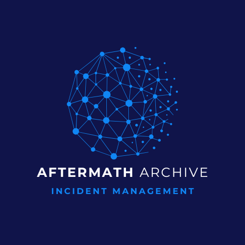

# Aftermath Archive

**Aftermath** Archive is a streamlined incident management and post-mortem documentation app designed for IT and development teams. 

This app provides a central repository for capturing and analyzing system incidents, helping teams understand root causes, log key insights, and prevent future occurrences. 

By simplifying post-mortem tracking and organizing incidents in an accessible way, Aftermath Archive empowers teams to continuously improve reliability and reduce downtime.